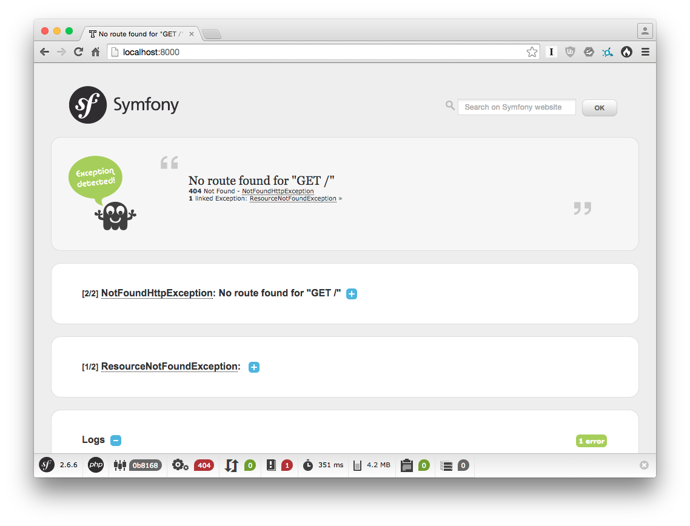

REST: From Zero To Hero
=======================

This provided Symfony edition is based on the [Symfony minimal
edition](https://github.com/beberlei/symfony-minimal-distribution).

## Installation

Get the code by cloning this repository:

    $ git clone git@github.com:willdurand/workshop-rest-from-zero-to-hero.git

Install the project's dependencies:

    $ composer install

Configure the project by renaming the `.env.dist` file to `.env`:

    $ cp .env.dist .env

Run the application:

    $ bin/console server:start --router=`pwd`/router.php

**Note 1:** defining the `--router` option is required here because default
Symfony routers hardcode the front controller name (in this project it is
`index.php`, while Symfony uses `app[_dev].php`).

**Note 2:** as you might notice, the `console` script is located into the `bin/`
folder, not in `app/`.

Browse [http://localhost:8000/](http://localhost:8000/).

## Instructions

[1. Serialization](doc/1-serialization.md)

[2. The `ApiBundle` (a.k.a. the Read part)](doc/2-the-apibundle.md)

[3. Pagination](doc/3-pagination.md)

[4. Testing](doc/4-testing.md)

[5. The "Create" Part](doc/5-the-create-part.md)

[6. The "Update" Part](doc/6-the-update-part.md)

[7. Content Negotiation](doc/7-content-negotiation.md)

[8. Document All The Things!](doc/8-documentation.md)

[9. Hateoas](doc/9-hateoas.md)

[10. Security](doc/10-security.md)

License
-------

This workshop (code + text) is released under the MIT License. See the bundled
LICENSE file for details.
