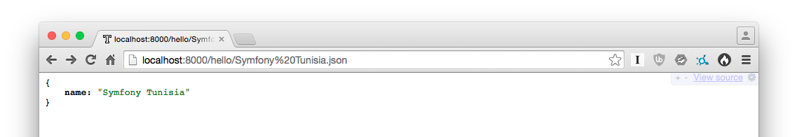
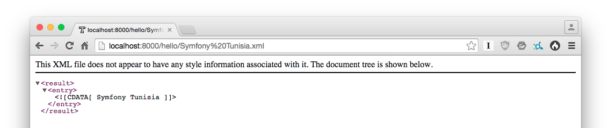
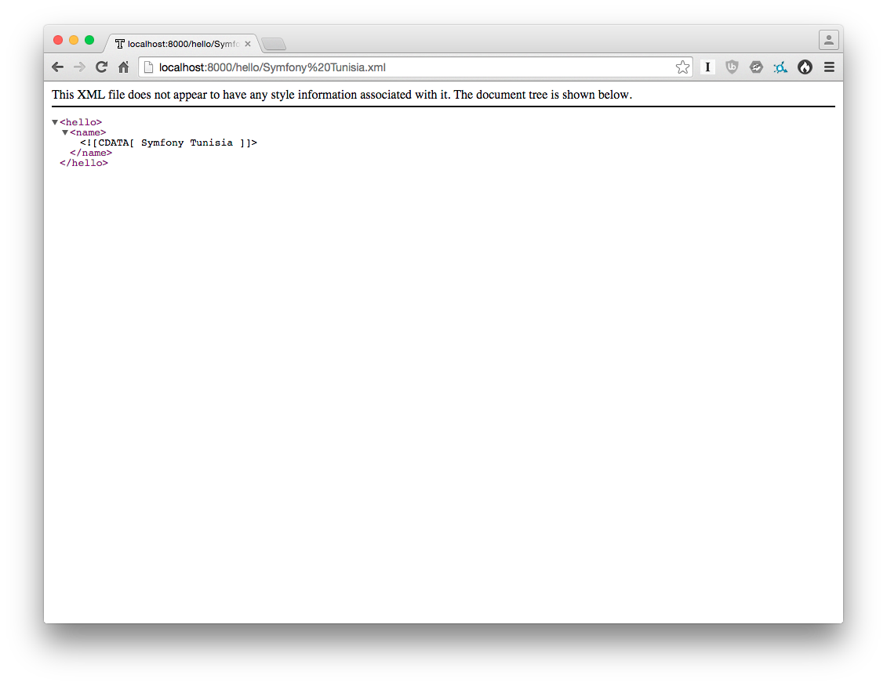
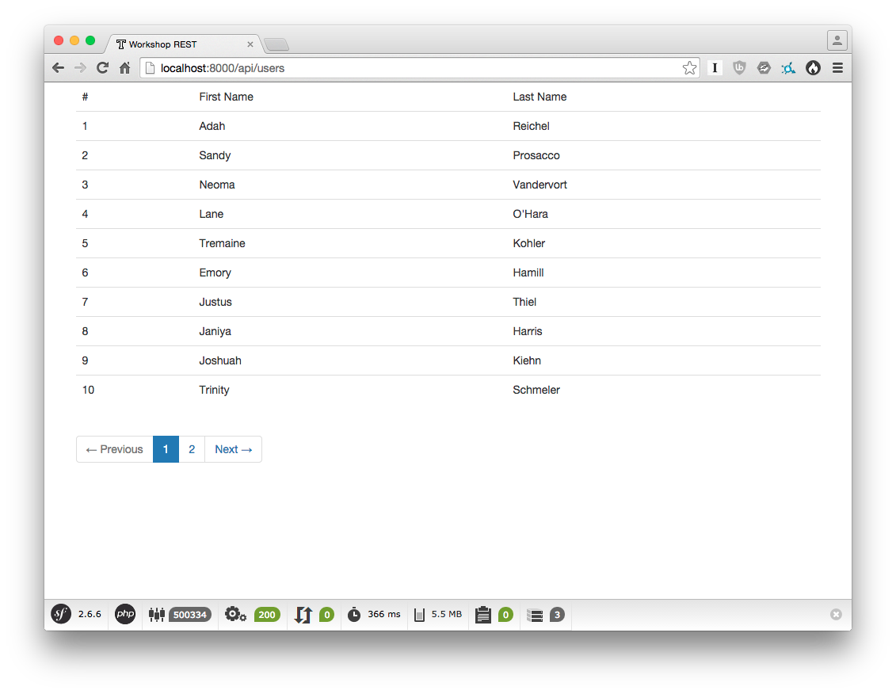
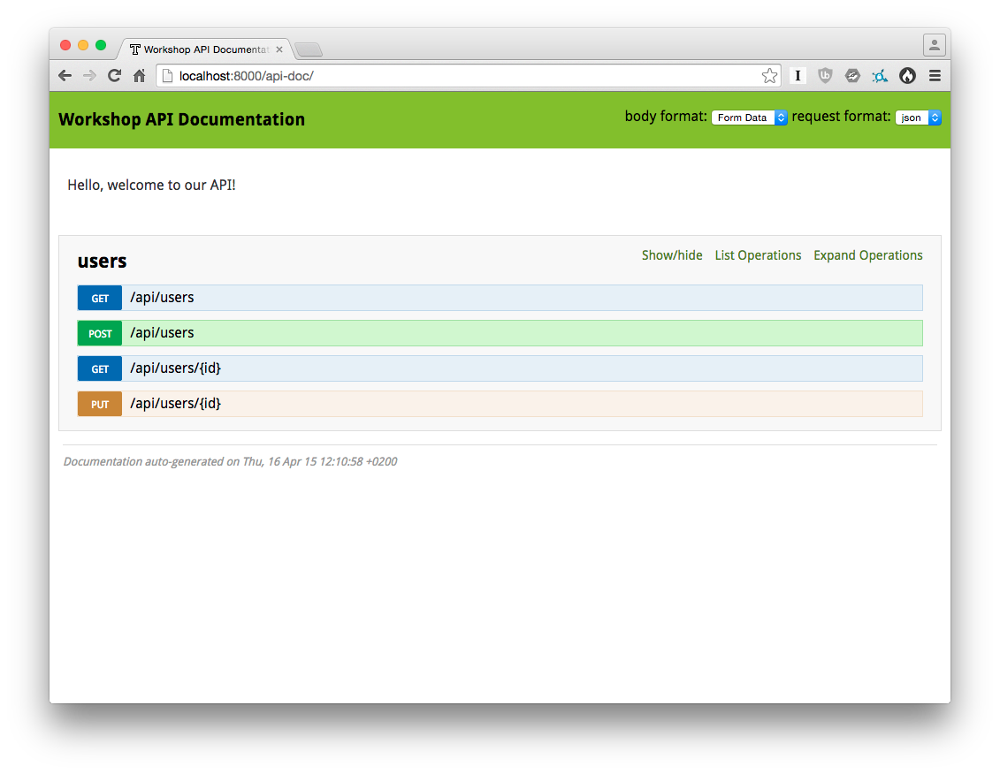

REST: From Zero To Hero
=======================

This provided Symfony edition is based on the [Symfony minimal
edition](https://github.com/beberlei/symfony-minimal-distribution).


## Installation

Get the code by cloning this repository:

    $ git clone git@github.com:willdurand/workshop-rest-from-zero-to-hero.git

Install the project's dependencies:

    $ composer install

Configure the project by renaming the `.env.dist` file to `.env`:

    $ cp .env.dist .env

Run the application:

    $ bin/console server:start --router=`pwd`/router.php

**Note 1:** defining the `--router` option is required here because default
Symfony routers hardcode the front controller name (in this project it is
`index.php`, while Symfony uses `app[_dev].php`).

**Note 2:** as you might notice, the `console` script is located into the `bin/`
folder, not in `app/`.

Browse [http://localhost:8000/](http://localhost:8000/).


## 1 - Serialization

### 1.1 - JMSSerializerBundle

Serialization is brought to you by the
[JMSSerializerBundle](http://jmsyst.com/bundles/JMSSerializerBundle) bundle, for free
;-) Serialization is the process of transforming a graph of objects into a structured data format (XML, YAML, JSON but also binary).

**Task:** Start by modifying the `DefaultController` class to use the
`jms_serializer` service and return either some XML, HTML, or JSON.

> **Tip:** If there is one thing to retain, it is that serialization takes the exact same data set as input, but outputs it in different formats.





### 1.2 - JMSSerializerBundle + FOSRestBundle = &hearts;

A small [Behat](http://docs.behat.org) test suite is provided:

    $ bin/behat features/basic-serialization.feature

> **Tip:** Always cover your code by test. If you don't feel good enough with unit testing, functional testing might be an option as it is often easier to understand.

The [FOSRestBundle](https://github.com/FriendsOfSymfony/FOSRestBundle)
integrates with the JMSSerializerBundle, and provides the same feature throught
the concept of
"[views](http://symfony.com/doc/master/bundles/FOSRestBundle/2-the-view-layer.html)".

**Task:** Configure the FOSRestBundle to leverage [the View
layer](http://symfony.com/doc/master/bundles/FOSRestBundle/2-the-view-layer.html).

> **Tip:** FOSRestBundle leverages the JMSSerializerBundle for the "serialization" part. If you only use this feature, no need to use the FOSRestBundle. However, this bundle provides many interesting features that we are going to cover in the following.

### 1.3 - Leveraging JMSSerializerBundle

**Task:** Configure the XML output to get the following document:

```xml
<hello>
    <name><![CDATA[ will ]]></name>
</hello>
```

> **Tip:** Your response does not have to be the mirror of your database schema. When building an API, you should think about the response first, and then about how to store data.



## 2 - The `ApiBundle` (a.k.a. the Read part)

### 2.1 - Bootstrap

**Task:** Create a bundle called `ApiBundle`.

**Task:** Create a `User` class with a few attributes (`id`, `firstName`, `lastName`,
`birthDate`, etc.) and configure Doctrine mapping on it.

### 2.2 - Fixtures with Alice

**Task:** Uncomment the `DoctrineFixturesBundle` and `HautelookAliceBundle` into the
`app/AppKernel.php` file. You can now quickly write _fixtures_ using
[Alice](https://github.com/nelmio/alice/blob/master/README.md).

**Task:** Create a `Acme\ApiBundle\DataFixtures\ORM\Loader`. This class should extend `Hautelook\AliceBundle\Alice\DataFixtureLoader` and implement a `getFixtures()` method:

```php
protected function getFixtures()
{
    return [
        __DIR__ . '/users.yml',
    ];
}
```

**Task:** Write Alice configuration in a `users.yml` file, and run the command above to load fixtures:

    $ bin/console doctrine:fixtures:load

> **Tip:** Always develop your application with (fake) data. Fixtures are a convenient way to populate your database without any effort.

### 2.3 - Playing with FOSRestBundle Views

**Task:** Add an empty controller `UserController` into your `ApiBundle`.

**Task:** Write a method named `allAction()` that returns all users throught a FOS
view, using annotations (`@Get` and `@View`).

The JSON response should look like this:

```json
{
    "users": [
        {
            "birth_date": "2012-03-24T00:00:00+0100",
            "first_name": "Adah",
            "id": 1,
            "last_name": "Reichel"
        }
    ]
}
```

The XML response should look like this:

```xml
<?xml version="1.0" encoding="UTF-8"?>
<users>
    <user id="1">
        <first_name><![CDATA[Adah]]></first_name>
        <last_name><![CDATA[Reichel]]></last_name>
        <birth_date><![CDATA[2012-03-24T00:00:00+0100]]></birth_date>
    </user>
</users>
```


## 3 - Pagination

[Pagerfanta](https://github.com/whiteoctober/Pagerfanta) is a well-known and
powerful PHP pager. Let's use it!

### 3.1 - WhiteOctoberPagerfantaBundle

**Task:** In order to use it, uncomment the line to enable the
[WhiteOctoberPagerfantaBundle](https://github.com/whiteoctober/WhiteOctoberPagerfantaBundle)
in the `AppKernel` class.

### 3.2 - Introducing [Query|Request] Params

**Task:** By combining FOSRestBundle `@QueryParam` and the Pagerfanta, modify the
`allAction()` to provide a paginated collection.



### 3.3 - Retrieving a user

**Task:** Create a `getAction()` that returns a given user.


## 4 - Testing

**Task:** Write scenarios (tests) to cover the features of the `allAction()`
method.

Keep in mind that Behat runs the application with the `test` environment, so be sure to
create a database and load fixtures in this environment.


## 5 - The "Create" Part

### 5.1 - Form

**Task:** Use the [Form](http://symfony.com/doc/current/book/forms.html) component
to add a new user. This action must be named `postAction()`.

You will have to configure the
[Validation](http://symfony.com/doc/current/book/validation.html) layer.

### 5.2 - Testing, again!

In a better world, you would not use
[Behat/Symfony2Extension](https://github.com/Behat/Symfony2Extension) but rather
the [Behat/WebApiExtension](https://github.com/Behat/WebApiExtension). Because
we are not in the real world, let's continue with the former extension. You
can find two _scenarios_ below:

```
    Scenario: Add a new user
        Given I am on "/api/users"
        When I send:
        """
        {
            "user": {
                "firstName": "John",
                "lastName": "Doe",
                "birthDate": "1988-01-01"
            }
        }
        """
        Then the status code should be 201

    Scenario: Add a new user with invalid data
        Given I am on "/api/users"
        When I send:
        """
        {
            "user": {
            }
        }
        """
        Then the status code should be 400
        And it should contain the following JSON content:
        """
        {
            "code": 400,
            "errors": {
                "children": {
                    "birthDate": [],
                    "firstName": {
                        "errors": [
                            "This value should not be blank."
                        ]
                    },
                    "lastName": {
                        "errors": [
                            "This value should not be blank."
                        ]
                    }
                }
            },
            "message": "Validation Failed"
        }
        """
```


## 6 - The ""Update" Part

**Task:** Refactor your code to allow modifying existing entities.

> **Tip:** Try to decouple your code as much as you can, so that you can be more
efficient later.

**Task:** Write a scenario to cover this new feature.


## 7 - Content Negotiation

The FOSRestBundle provides a [Format
Listener](http://symfony.com/doc/master/bundles/FOSRestBundle/3-listener-support.html#format-listener)
that does content negotitation (black) magic for you, leveraging the
[Negotiation](https://github.com/willdurand/Negotiation) library.

**Task:** Enable the format listener, and play with `curl` or
[HTTPie](https://github.com/jkbr/httpie).


## 8 - Document All The Things!

Introducing the
[NelmioApiDocBundle](https://github.com/nelmio/NelmioApiDocBundle), a bundle
that generates great documentation for you!

**Task:** Write documentation for the different actions. Group them into a _users_
section.




## 9 - Hateoas

HATEOAS stands for Hypermedia as the Engine of Application State, and adds
hypermedia links to your representations (i.e. your API responses). [HATEOAS is
about the discoverability of actions on a
resource](http://timelessrepo.com/haters-gonna-hateoas). This is a
**requirement** for building a REST API.

The [Hateoas](https://github.com/willdurand/Hateoas) PHP library leverages the
(JMS) Serializer library to provide a nice way to build HATEOAS REST web
services.


## 10 - Security

The Symfony documentation contains a cookbook entry on [How to Authenticate
Users with API
Keys](http://symfony.com/doc/current/cookbook/security/api_key_authentication.html).
